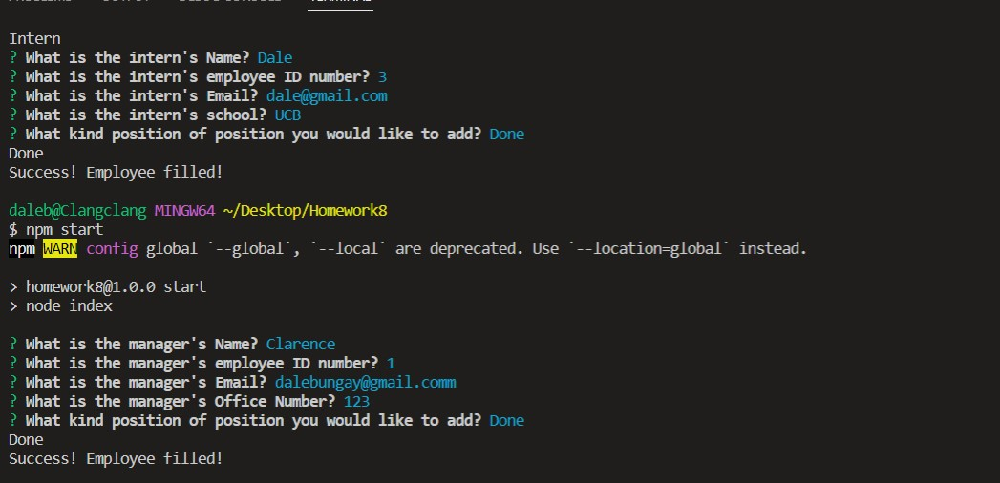
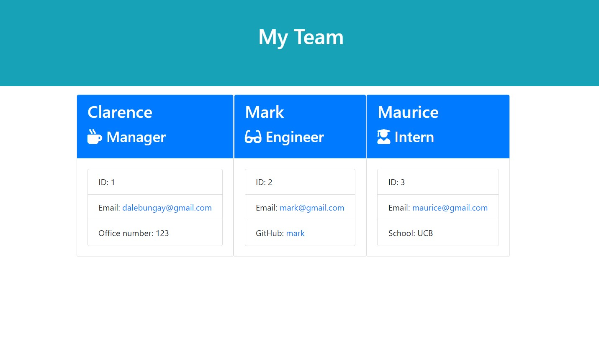

# Team Profile Generator

## Description

The Team Profile Generator is a command-line-input application run in Node that requests information from the user about members of an engineering team and generates an HTML file displaying that information. Before running the application the user must perform an npm install to install all required dependencies.

# Screenshot

# Video
[Demo Video](https://drive.google.com/file/d/1RQUBtMde1LfbYDUxeuQwml5nJ5HnKBje/view)
